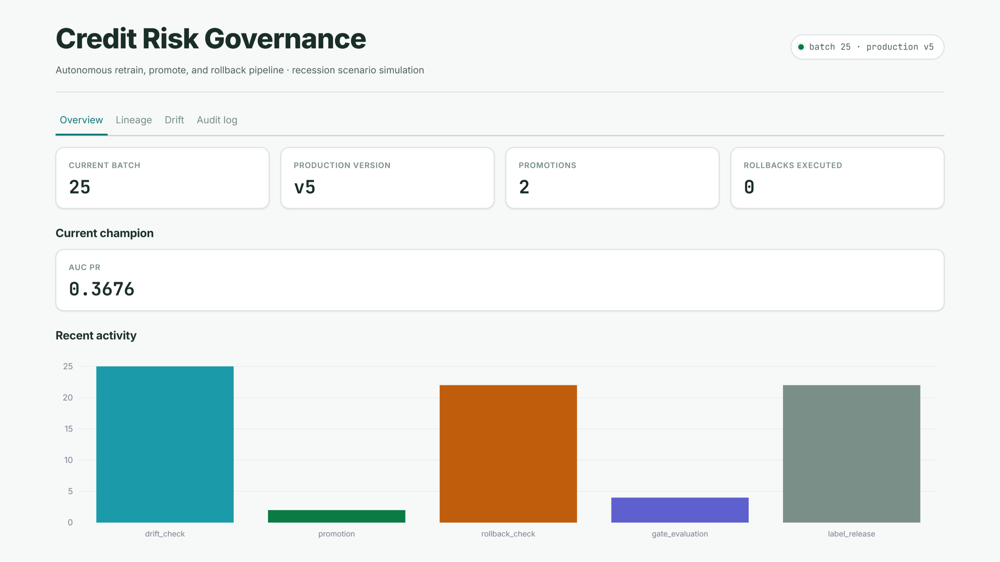
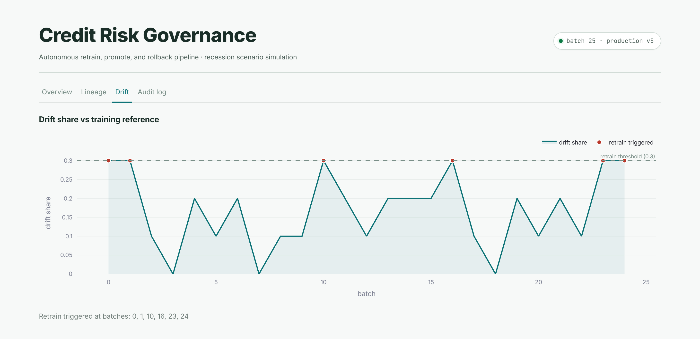
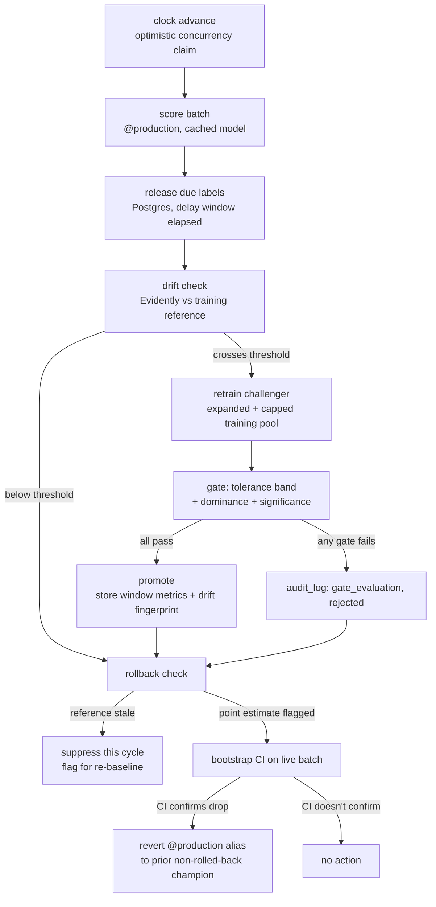

# Continuous Credit Risk Governance Pipeline

A self-governing ML pipeline that simulates a credit risk classifier's full production lifecycle: score a live batch, wait for delayed ground-truth labels, detect distribution drift, retrain a challenger, gate it against the current champion with a real significance test, for promotion or rejection, and roll back if the model in production starts underperforming, all without a human in the loop.

Built as a portfolio project on entirely free-tier infrastructure: no paid APIs, no GPU, no local database server.

## Preview

<p align="center">
  
  <br>
  <sub>Main UI: Overview of the pipeline with current champion, batches, versions and rollbacks</sub>
</p>

<p align="center">
  
  <br>
  <sub>Drift tab: per-batch drift share against the training reference</sub>
</p>

> Additional screenshots for other tabs are in [`images/`](images/).

## What this is

A model doesn't stay good just because it was good at launch. This project simulates the part of the ML lifecycle that usually gets hand-waved in a portfolio: what happens *after* deployment, when the world drifts and the model has to be watched, challenged, and sometimes replaced, automatically and defensibly.

Given a frozen batch of applicants:

1. Scores them with whatever model is currently aliased `@production`.
2. Releases ground-truth labels for whichever earlier batch's delay window just elapsed.
3. Checks the current batch for distribution drift against the original training reference (Evidently).
4. If drift crosses threshold, retrains a challenger on an expanding pool of real labeled data and evaluates it against the champion through three gates: not meaningfully worse, genuinely better, and statistically significant, not just noise.
5. Promotes the challenger only if all three gates pass, recording the drifted window it was gated against (not a stale holdout) as the reference for future rollback decisions.
6. Checks whether the current champion has degraded enough, and significantly enough, to roll back to a prior version.

Every decision, promotions, rejections, drift checks, and rollback checks, is written to an audit log, not just the ones that changed something. The whole loop runs on a schedule via GitHub Actions, with no human triggering each tick.

## Architecture



Every branch writes to `audit_log`. The gate's rejection reason and the rollback check's suppression reason are first-class recorded events, not just the promote/revert paths.

## Governance parameters

| Parameter | Value | Why |
|---|---|---|
| Primary metric | AUC-PR | Accuracy is close to meaningless at ~6.7% positive rate. |
| Tolerance band | 0.01 | Challenger must not fall meaningfully below champion before anything else is considered. |
| Dominance | challenger > champion | A tie within tolerance is not promoted; genuine improvement is required. |
| Significance | McNemar (paired, matched batch) or bootstrap CI when discordant pairs < 15 | With ~200 rows and ~13 positives per batch, McNemar is frequently underpowered; the bootstrap fallback exists specifically for that case, not as an afterthought. |
| Drift share threshold | 0.3 (3+ of 10 features individually flagged) | At 0.1, one spuriously-flagged feature out of 10 independent K-S tests (alpha=0.05, no correction) triggers a false retrain on ~40% of undrifted batches. 0.3 drops that to ~1% while still reliably catching real injected drift (3-5 features affected). |
| Rollback drop threshold | 0.03 AUC-PR, bootstrap-CI-confirmed | A raw point-estimate threshold on one ~200-row batch swings on sampling noise alone; the CI's upper bound must still clear the threshold, not just the single estimate. |
| Delayed labels | 3 batches | Simulates realistic label latency; nothing is evaluated against ground truth that wouldn't actually be available yet. |

## Design decisions that took more than one attempt to get right

Documenting these because they were the actual hard part, not the initial build:

- **The gate's job is to reject noise, not reward luck.** Comparing champion and challenger AUC-PR directly on tiny batches made random variation look like improvement. The three gates, tolerance, dominance, and significance, separate real gains from sampling noise.

- **Rollback needs the same rigor as promotion.** Promotion used significance testing, but rollback initially relied on a noisy point estimate and repeatedly triggered on pure noise. Fixed by requiring the bootstrap CI's upper bound to confirm a real performance drop.

- **A challenger must actually be able to adapt.** Retraining on the full 127,501-row base pool diluted a few hundred new labels into irrelevance. The pool is now capped and subsampled so recent post-drift data can materially change the fit.

- **Rollback must reference the drifted window, not a pristine holdout.** A frozen holdout confounds model degradation with changes in the world. Promotion now stores performance and a drift fingerprint for the evaluated window, and comparisons are suppressed once that reference goes stale.

- **Claim the batch before doing any work.** Concurrent scheduled and manual runs could both execute before one lost the version race, creating duplicate predictions and audit rows. Optimistic concurrency now claims the batch first, and losers do zero work.

- **Split before fitting.** Imputation medians were initially fit before the holdout split, leaking holdout information into training. The split now happens first, with medians fit only on the training pool.

- **Never store the answer with the features.** Scoring wrote the full row, including the true label, into features, violating the delayed-label assumption and creating a future leakage path. Only actual model input columns are now stored.

## Data and drift simulation

[Give Me Some Credit](https://www.kaggle.com/c/GiveMeSomeCredit) (Kaggle competition dataset, 150,000 rows, ~6.7% positive rate), split into a frozen 22,499-row holdout and a 127,501-row training pool, batched into 637 batches of 200 rows to simulate a live stream.

A recession scenario is injected on top of the real data, deterministically:
- **Persistent drift** (batch 10 onward, never reverts): `DebtRatio` and `RevolvingUtilizationOfUnsecuredLines` shift and scale upward, `MonthlyIncome` shrinks.
- **Temporary concept drift** (batches 15-20, then reverts): delinquent borrowers' feature values blend toward the non-delinquent centroid, simulating a period where the usual risk signals stop being as predictive.

## Persistence

Postgres (Neon), four tables: `pipeline_state` (single-row clock, optimistic concurrency via a version column), `predictions` (one row per scored prediction, label filled in on release), `champion_history` (N-hop promotion lineage with window metrics and drift fingerprint per entry, not just current/previous), `audit_log` (every governance decision, keyed by event type).

Model artifacts and registry: MLflow on DagsHub, alias-based (`@production`, `@challenger`), never the deprecated stage-based API. Raw and processed data: DVC against a DagsHub-hosted S3-compatible remote.

## Project structure

```
credit-risk-autopilot/
├── config/
│   ├── drift_params.yaml       # recession scenario parameters
│   └── gate_config.yaml        # primary metric, tolerance band, significance, thresholds
│
├── data/
│   ├── raw/                    # cs-training.csv placed here manually, gitignored
│   └── processed/               # generated by run_demo_loop.py
│
├── src/
│   ├── data/                   # ingest, leakage-safe split, drift injection
│   ├── db/                     # connection, repository (bulk ops), schema.sql
│   ├── model/                  # training, feature constants
│   ├── gate/                   # evaluate.py, pure logic, most heavily tested file
│   ├── drift/                  # Evidently wrapper, reused for retrain trigger + fingerprint
│   ├── orchestration/          # clock (single writer), pipeline, promote/rollback
│   ├── serving/                # FastAPI, cached model reload on alias change
│   └── utils/                  # config loading, shared model cache
│
├── dashboard/
│   ├── app.py
│   └── views/                  # overview, lineage, drift, audit_log
│
├── scripts/
│   ├── advance_clock.py        # entrypoint cron and manual runs both call
│   ├── run_demo_loop.py        # full bootstrap -> drift -> retrain -> promote -> rollback run
│   └── smoke_test_mlflow.py    # fast connectivity check before a full run
│
├── tests/                      # 54 tests
│
├── .github/workflows/
│   ├── ci.yml                  # lint + test on push/PR
│   └── cron_advance.yml        # scheduled clock advance, verified running end to end
│
├── .streamlit/config.toml
├── .gitignore
├── pyproject.toml
├── requirements.txt
├── .env.example
└── README.md
```

## Getting started

### 1. Accounts (all free tier)

- [Neon](https://neon.tech) for Postgres.
- [DagsHub](https://dagshub.com) for MLflow tracking/registry and a DVC-compatible remote.
- [Kaggle](https://www.kaggle.com) for the dataset (competition, not a plain dataset, see below).
- [Groq](https://console.groq.com) (optional, for the single decision-explanation call).

### 2. Install

```
python -m venv venv && source venv/bin/activate
pip install -r requirements.txt
cp .env.example .env   # fill in DATABASE_URL, MLFLOW_TRACKING_*
```

### 3. Dataset

This is a Kaggle *competition* dataset, which requires accepting competition rules on the site and isn't reachable via the plain dataset API even with valid credentials (that path returns a 403). Download manually from the [competition page](https://www.kaggle.com/c/GiveMeSomeCredit/data) and place `cs-training.csv` in `data/raw/`.

### 4. Database

No local `psql` needed. Paste [`src/db/schema.sql`](src/db/schema.sql) into Neon's SQL Editor, or let `run_demo_loop.py` apply it automatically on first run (it's idempotent, `CREATE TABLE IF NOT EXISTS` throughout).

Neon's dashboard gives a plain `postgresql://` connection string; this project needs the `postgresql+psycopg://` scheme (psycopg v3, not the psycopg2 SQLAlchemy defaults to). `src/db/connection.py` normalizes this automatically even if you paste the plain version, but the `.env.example` template already has the correct scheme.

### 5. DVC remote (DagsHub)

DagsHub's DVC remote is not a bucket you name yourself. It's a fixed placeholder URL (`s3://dvc`) proxied through a separate `endpointurl` that points at your specific repo, both of which are easy to miss and produce confusing errors if skipped.

The exact commands, pre-filled with your username, repo name, and a token, are on your DagsHub repo page: **Remote** button (top right) then **Data** tab then **DVC**. They look like this:

```
dvc init
dvc remote add -d origin s3://dvc
dvc remote default origin
dvc remote modify origin endpointurl https://dagshub.com/<user>/<repo>.s3
dvc remote modify origin --local access_key_id <dagshub-token>
dvc remote modify origin --local secret_access_key <dagshub-token>
```

Notes that cost real debugging time to learn:
- **Same token for both fields.** `access_key_id` and `secret_access_key` are the same DagsHub token, not a username/token pair.
- **`dvc remote default origin` is required even after `-d`.** The `-d` flag on `add` doesn't reliably persist as the default on its own.
- **Use a token from Settings then Tokens, not the Remote dropdown's session token.** The token DagsHub shows inline in the Remote setup page can be a short-lived session token. A token generated from your DagsHub account's Settings then Tokens page is long-lived and won't expire out from under a scheduled job.

Then track and push the data:

```
dvc add data/raw/cs-training.csv data/processed/*.pkl
git add data/raw/*.dvc data/processed/*.dvc .dvc/config
git commit -m "Track data with DVC"
git push
dvc push
```

Verify it actually uploaded, don't just trust that the command exited 0:

```
dvc status -c   # should report nothing pending against the remote
```

### 6. GitHub Actions secrets (for the scheduled cron job)

`cron_advance.yml` runs `advance_clock.py` on a schedule against a fresh, empty checkout every time, so it needs every credential the pipeline uses, set as repository secrets (Settings then Secrets and variables then Actions then New repository secret), not just available in your local `.env`:

| Secret name | Value | Notes |
|---|---|---|
| `DATABASE_URL` | Neon connection string | Must use `postgresql+psycopg://`, same as local. |
| `MLFLOW_TRACKING_URI` | `https://dagshub.com/<user>/<repo>.mlflow` | If this is missing, MLflow does not error, it silently falls back to a brand-new local SQLite database on the runner. Every model lookup then fails with a confusing "Registered Model not found," because it's looking at an empty database, not a broken one. |
| `MLFLOW_TRACKING_USERNAME` | Your DagsHub username | |
| `MLFLOW_TRACKING_PASSWORD` | A DagsHub access token | From Settings then Tokens, same long-lived-token guidance as above. |
| `DVC_ACCESS_KEY_ID` | Your DagsHub token | Same token you used for the local DVC remote setup. |
| `DVC_SECRET_ACCESS_KEY` | Your DagsHub token | Same token, both fields. |
| `LOGFIRE_TOKEN` | (optional) | Tracing no-ops without it. |

Two things specific to how the workflow uses these that are worth knowing if you ever edit it:
- `dvc pull` in CI needs credentials exposed as `AWS_ACCESS_KEY_ID` / `AWS_SECRET_ACCESS_KEY`, not `DVC_ACCESS_KEY_ID` / `DVC_SECRET_ACCESS_KEY`. `dvc-s3` is boto3 under the hood, and boto3's environment-variable credential fallback only recognizes the standard AWS names. The repo secrets keep the `DVC_*` names for clarity in the GitHub UI; the workflow maps them to the AWS names internally when invoking `dvc pull`.
- The workflow has a preflight step that checks `.dvc/` exists and both DVC secrets are non-empty before attempting `dvc pull`, failing with a plain-English message and the setup commands above instead of DVC's generic "not inside of a DVC repository" error.

Once all seven secrets are set, trigger the workflow manually first (Actions then Advance pipeline clock then Run workflow) rather than waiting for the schedule, so you get fast feedback if anything's misconfigured. Verified running successfully end to end on a real schedule as of this writing.

## Running it

```
python scripts/smoke_test_mlflow.py   # fast connectivity check, seconds not minutes
python scripts/run_demo_loop.py       # full run: bootstrap -> drift -> retrain -> promote -> rollback
uvicorn src.serving.app:app --reload  # score a single applicant, GET /model-info, POST /predict
streamlit run dashboard/app.py        # explore the result
```

A full 25-batch run takes roughly 5-15 minutes, dominated by MLflow round trips to DagsHub on every retrain, not local compute.

`scripts/smoke_test_mlflow.py` prints the tracking URI it's actually connected to and refuses to report success unless it looks like a DagsHub URL, specifically so it can't give a false "connectivity OK" against a local fallback store the way it once did during development.

## Testing

54 tests across 8 files, all pure-logic or mocked, no live infrastructure required to run them. The gate (`test_gate.py`) is the most heavily tested module: tolerance-band rejection, dominance rejection, McNemar-vs-bootstrap routing at the discordant-pair threshold, and, specifically, a fixed-seed reproduction of a challenger that looks better purely from small-sample noise, which the gate must reject.

`tests/test_drift_detect.py` pins a real captured `evidently==0.7.21` output as a regression fixture: an earlier version of the fingerprint extraction silently matched on a key that didn't exist in the real schema and returned `drift_share=None` on every call, so retrain never triggered across a full 25-tick run despite real, measurable drift. That specific payload is now a permanent test case.

```
pytest tests -v
ruff check src tests scripts dashboard
```

## Known limitations

- **McNemar is frequently underpowered at this batch size.** ~200 rows and ~13 positives per batch rarely produces the 15+ discordant pairs McNemar needs; the bootstrap CI fallback is the common path, not the exception. This is by design, not an oversight, but it means the significance check is often working with limited statistical power.
- **The Evidently schema match is verified against one live capture (0.7.21)**, not guaranteed stable across versions.
- **Rollback rarely has anywhere to revert to in a short run.** With only one or two promotions in a 25-batch demo, most rollback triggers find no valid prior champion and correctly do nothing beyond flagging. The underlying mechanism is exercised and tested (`find_previous_champion`, N-hop selection, staleness suppression), but a longer run with more promotions would exercise an actual reversion more directly.
- **Model quality is not the point.** The challenger is a plain logistic regression on purpose; the governance loop around it, not the model itself, is the deliverable.