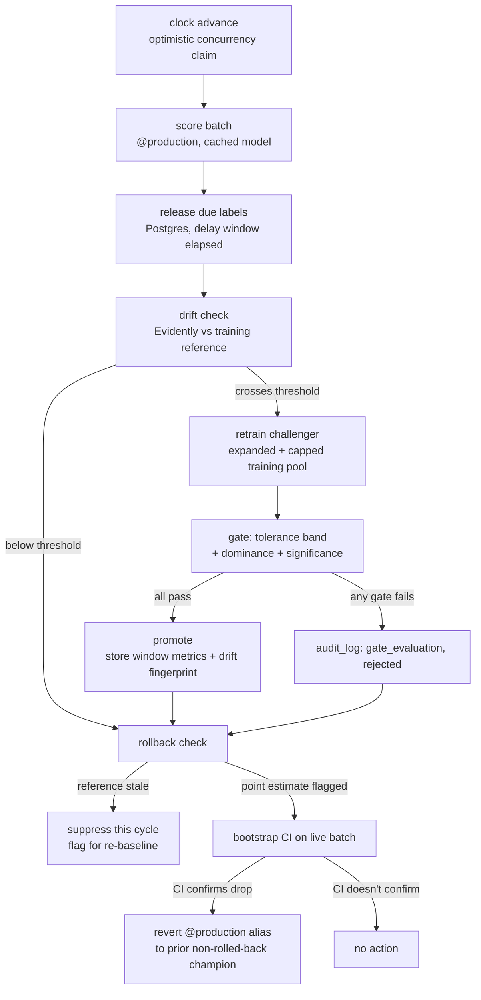

# Continuous Credit Risk Governance Pipeline

A self-governing ML pipeline that simulates a credit risk classifier's full production lifecycle: score a live batch, wait for delayed ground-truth labels, detect distribution drift, retrain a challenger, gate it against the current champion with a real significance test, promote or reject, and roll back if the model in production starts underperforming, all without a human in the loop.

Built as a portfolio project on entirely free-tier infrastructure: no paid APIs, no GPU, no local database server.

## Preview

<p align="center">
  
  <br>
  <sub><em>Overview: current clock position, current champion's window AUC-PR, and a full breakdown of every governance event type recorded.</em></sub>
</p>

<p align="center">
  
  <br>
  <sub><em>Drift: per-batch drift share against the training reference, with retrain-triggered batches marked (0, 1, 10, 16, 23, 24 in this run, matching the recession scenario's injected drift windows).</em></sub>
</p>

## What this is

A model doesn't stay good just because it was good at launch. This project simulates the part of the ML lifecycle that usually gets hand-waved in a portfolio: what happens *after* deployment, when the world drifts and the model has to be watched, challenged, and sometimes replaced, automatically and defensibly.

Given a frozen batch of applicants:

1. Scores them with whatever model is currently aliased `@production`.
2. Releases ground-truth labels for whichever earlier batch's delay window just elapsed.
3. Checks the current batch for distribution drift against the original training reference (Evidently).
4. If drift crosses threshold, retrains a challenger on an expanding pool of real labeled data and evaluates it against the champion through three gates: not meaningfully worse, genuinely better, and statistically significant, not just noise.
5. Promotes the challenger only if all three gates pass, recording the drifted window it was gated against (not a stale holdout) as the reference for future rollback decisions.
6. Checks whether the current champion has degraded enough, and significantly enough, to roll back to a prior version.

Every decision, promotions, rejections, drift checks, and rollback checks, is written to an audit log, not just the ones that changed something.

## Architecture



Every branch writes to `audit_log`. The gate's rejection reason and the rollback check's suppression reason are first-class recorded events, not just the promote/revert paths.

## Governance parameters

| Parameter | Value | Why |
|---|---|---|
| Primary metric | AUC-PR | Accuracy is close to meaningless at ~6.7% positive rate. |
| Tolerance band | 0.01 | Challenger must not fall meaningfully below champion before anything else is considered. |
| Dominance | challenger > champion | A tie within tolerance is not promoted; genuine improvement is required. |
| Significance | McNemar (paired, matched batch) or bootstrap CI when discordant pairs < 15 | With ~200 rows and ~13 positives per batch, McNemar is frequently underpowered; the bootstrap fallback exists specifically for that case, not as an afterthought. |
| Drift share threshold | 0.3 (3+ of 10 features individually flagged) | At 0.1, one spuriously-flagged feature out of 10 independent K-S tests (alpha=0.05, no correction) triggers a false retrain on ~40% of undrifted batches. 0.3 drops that to ~1% while still reliably catching real injected drift (3-5 features affected). |
| Rollback drop threshold | 0.03 AUC-PR, bootstrap-CI-confirmed | A raw point-estimate threshold on one ~200-row batch swings on sampling noise alone; the CI's upper bound must still clear the threshold, not just the single estimate. |
| Delayed labels | 3 batches | Simulates realistic label latency; nothing is evaluated against ground truth that wouldn't actually be available yet. |

## Design decisions that took more than one attempt to get right

Documenting these because they were the actual hard part, not the initial build:

- **The gate's job is to reject noise, not just reward improvement.** Early on, comparing champion and challenger AUC-PR directly on a tiny batch made "improvement" indistinguishable from sampling luck. The three-gate structure (tolerance, dominance, significance) exists because a challenger that looks better on 200 rows often isn't, and the pipeline needs to know the difference.
- **Rollback needed the same rigor as promotion, and initially didn't have it.** The promotion gate always had a significance test; the rollback check originally didn't, comparing a single noisy point estimate against a threshold. A real run showed `rollback_triggered: True` firing repeatedly on pure noise. Fixed by requiring a bootstrap CI's upper bound, not the raw point estimate, to confirm the drop.
- **A challenger retrained on the full static base pool can never actually adapt.** Appending a few hundred newly-labeled rows to a 127,501-row base pool dilutes them to a rounding error; the challenger ends up statistically indistinguishable from the champion regardless of real drift. The base pool is capped and subsampled before each retrain so recently-labeled, post-drift data can actually move the fit.
- **The rollback reference must be the drifted window the model was gated against, not the pristine holdout.** Comparing live performance to a frozen holdout metric conflates "the model got worse" with "the world changed since launch." Promotion stores the challenger's performance on the actual window it was evaluated against, plus a drift fingerprint of that window, so later comparisons are apples to apples, and are suppressed rather than trusted once that reference itself goes stale.
- **Exactly one writer for the clock, and the claim happens before the work, not after.** Two overlapping callers (a scheduled run and a manual one) racing on `pipeline_state` could otherwise both do a batch's work and only one would lose the version race, leaving duplicate predictions and audit rows committed anyway. The batch is claimed via optimistic concurrency first; a losing caller does zero work.
- **The holdout is carved before anything is fit on the data, not after.** Fitting imputation medians on the full dataset and only then splitting off a holdout leaks holdout information into training. The split happens first; medians are fit on the training pool only.

## Data and drift simulation

[Give Me Some Credit](https://www.kaggle.com/c/GiveMeSomeCredit) (Kaggle competition dataset, 150,000 rows, ~6.7% positive rate), split into a frozen 22,499-row holdout and a 127,501-row training pool, batched into 637 batches of 200 rows to simulate a live stream.

A recession scenario is injected on top of the real data, deterministically (fixed seed):
- **Persistent drift** (batch 10 onward, never reverts): `DebtRatio` and `RevolvingUtilizationOfUnsecuredLines` shift and scale upward, `MonthlyIncome` shrinks.
- **Temporary concept drift** (batches 15-20, then reverts): delinquent borrowers' feature values blend toward the non-delinquent centroid, simulating a period where the usual risk signals stop being as predictive.

## Persistence

Postgres (Neon), four tables: `pipeline_state` (single-row clock, optimistic concurrency via a version column), `predictions` (one row per scored prediction, label filled in on release), `champion_history` (N-hop promotion lineage with window metrics and drift fingerprint per entry, not just current/previous), `audit_log` (every governance decision, keyed by event type).

Model artifacts and registry: MLflow on DagsHub, alias-based (`@production`, `@challenger`), never the deprecated stage-based API. Raw and processed data: DVC against a DagsHub-hosted S3-compatible remote.

## Project structure

```
credit-risk-governance/
├── config/
│   ├── drift_params.yaml       # recession scenario parameters, seeded
│   └── gate_config.yaml        # primary metric, tolerance band, significance, thresholds
├── data/
│   ├── raw/                    # cs-training.csv placed here manually, gitignored
│   └── processed/               # generated by run_demo_loop.py
├── src/
│   ├── data/                   # ingest, leakage-safe split, drift injection
│   ├── db/                     # connection, repository (bulk ops), schema.sql
│   ├── model/                  # training, feature constants
│   ├── gate/                   # evaluate.py, pure logic, most heavily tested file
│   ├── drift/                  # Evidently wrapper, reused for retrain trigger + fingerprint
│   ├── orchestration/          # clock (single writer), pipeline, promote/rollback
│   ├── serving/                # FastAPI, cached model reload on alias change
│   └── utils/                  # config loading, shared model cache
├── dashboard/
│   ├── app.py
│   └── views/                  # overview, lineage, drift, audit_log
├── scripts/
│   ├── advance_clock.py        # entrypoint cron and manual runs both call
│   ├── run_demo_loop.py        # full bootstrap -> drift -> retrain -> promote -> rollback run
│   └── smoke_test_mlflow.py    # fast connectivity check before a full run
├── tests/                      # 55 tests
├── .github/workflows/
│   ├── ci.yml                  # lint + test on push/PR
│   └── cron_advance.yml        # scheduled clock advance
├── .streamlit/config.toml
├── pyproject.toml
├── requirements.txt
└── .env.example
```

## Getting started

1. **Accounts** (all free tier):
   - [Neon](https://neon.tech) for Postgres.
   - [DagsHub](https://dagshub.com) for MLflow tracking/registry and a DVC-compatible remote.
   - [Kaggle](https://www.kaggle.com) for the dataset (competition, not a plain dataset, see below).
   - [Groq](https://console.groq.com) (optional, for the single decision-explanation call).

2. **Install**
   ```
   python -m venv venv && source venv/bin/activate
   pip install -r requirements.txt
   cp .env.example .env   # fill in DATABASE_URL, MLFLOW_TRACKING_*
   ```

3. **Dataset**: this is a Kaggle *competition* dataset, which requires accepting competition rules on the site and isn't reachable via the plain dataset API even with valid credentials. Download manually from the [competition page](https://www.kaggle.com/c/GiveMeSomeCredit/data) and place `cs-training.csv` in `data/raw/`.

4. **Database**: no local `psql` needed. Paste [`src/db/schema.sql`](src/db/schema.sql) into Neon's SQL Editor, or let `run_demo_loop.py` apply it automatically on first run (it's idempotent, `CREATE TABLE IF NOT EXISTS` throughout).

## Running it

```
python scripts/smoke_test_mlflow.py   # fast connectivity check, seconds not minutes
python scripts/run_demo_loop.py       # full run: bootstrap -> drift -> retrain -> promote -> rollback
streamlit run dashboard/app.py        # explore the result
uvicorn src.serving.app:app --reload  # score a single applicant, GET /model-info, POST /predict
```

A full 25-batch run takes roughly 5-15 minutes, dominated by MLflow round trips to DagsHub on every retrain, not local compute.

## Testing

55 tests across 9 files, all pure-logic or mocked, no live infrastructure required to run them. The gate (`test_gate.py`) is the most heavily tested module: tolerance-band rejection, dominance rejection, McNemar-vs-bootstrap routing at the discordant-pair threshold, and, specifically, a fixed-seed reproduction of a challenger that looks better purely from small-sample noise, which the gate must reject.

`tests/test_drift_detect.py` pins a real captured `evidently==0.7.21` output as a regression fixture: an earlier version of the fingerprint extraction silently matched on a key that didn't exist in the real schema and returned `drift_share=None` on every call, so retrain never triggered across a full 25-tick run despite real, measurable drift. That specific payload is now a permanent test case.

```
pytest tests -v
ruff check src tests scripts
```

## Known limitations

- **McNemar is frequently underpowered at this batch size.** ~200 rows and ~13 positives per batch rarely produces the 15+ discordant pairs McNemar needs; the bootstrap CI fallback is the common path, not the exception. This is by design, not an oversight, but it means the significance check is often working with limited statistical power.
- **The Evidently schema match is verified against one live capture (0.7.21), not guaranteed stable across versions.** `_reduce_to_fingerprint()` matches on `config.type`, a versioned identifier string, which is more stable than the human-readable `metric_name`, but a future Evidently release could still change it. Re-verify against a live run if upgrading.
- **The cron-scheduled clock advance (`cron_advance.yml`) is written and wired to the same single-writer entrypoint as manual runs, but has not yet been verified running on an actual GitHub Actions schedule.** Manual runs via `run_demo_loop.py` and `advance_clock.py` are verified; the scheduled trigger itself is not.
- **Rollback rarely has anywhere to revert to in a short run.** With only one or two promotions in a 25-batch demo, most rollback triggers find no valid prior champion and correctly do nothing beyond flagging. The mechanism is exercised and tested (`find_previous_champion`, N-hop selection, staleness suppression), but a longer run with more promotions would exercise an actual reversion more directly.
- **Model quality is not the point.** The challenger is a plain logistic regression on purpose; the governance loop around it, not the model itself, is the deliverable.
